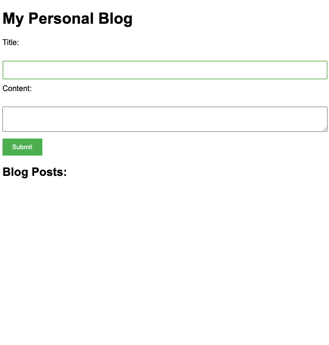

# Build a Personal Blogging Web Page

## Objective: 
The goal of this assignment is to create a personal blogging web page where the users can add new blog entries dynamically using a form. Each new entry should contain a title, content, and the date it was created.

## Criteria:

HTML: Create an HTML page that contains the following:

- A heading with the name of the blog
- A form with the following fields: title and content. The form should also contain a submit button
- An area (e.g., a div) where the blog entries will be dynamically added

CSS: Create a CSS file to style your blog page. Make sure to:

- Use a pleasant color scheme
- Style the form and submit button
- Style the area where the blog entries will appear

JavaScript: Here is where the main functionality comes in. You are to use JavaScript (and the DOM) to do the following:

- Capture the title and content entered into the input fields when the submit button is clicked
- Create a new blog entry that includes the title, content, and the current date
- Add the new blog entry to the blog entries area

## Additional Requirements:

The new blog entries should be added without refreshing the page (i.e., the form submission's default behavior should be prevented)
Each new blog entry should be added at the top, so the most recent entries are always first

The date should be displayed in a user-friendly format

Error handling: The form should not be submitted if any of the input fields are empty. Display an error message to the user in this case

## Evaluation Criteria:

- Correctness of HTML, CSS, and JavaScript code
- How well the JavaScript interacts with the DOM to dynamically add new blog entries
- Overall design and user experience of the blog page
- Responsiveness and styling of the page
- Error handling: Does the program handle empty form inputs gracefully?

## Extra Challenge:
Add the ability to delete individual blog entries, or add a 'Like' button to each blog entry and keep track of how many likes each entry has.

### Note
This assignment does not require any server-side programming or databases, so the blog entries will not be saved anywhere when the page is refreshed. 

